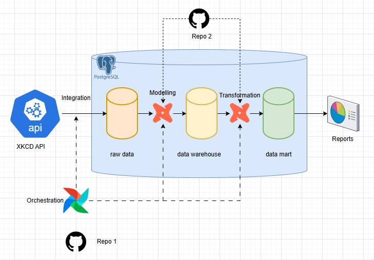

# JET case study

As part of this case study, I designed and implemented a data pipeline that integrates data from the XKCD Comics API, models it for analytics, and exposes it after applying business transformations. 
The pipeline leverages Apache **Airflow** for data integration and orchestration, and **dbt** for data modelling, transformation, and testing. And PostgreSQL as the data warehouse. 

---
## Technical overview



The data modelling and transformation logic, implemented using dbt, is maintained in a separate GitHub repository [jet_cs_dbt](https://github.com/nibinmg/jet_cs_dbt.git). During each Airflow DAG run, a dedicated task synchronizes the dbt repository into the Airflow runtime environment and executes the defined dbt models.

---
## Prerequisites

Make sure you have the following installed:

- Python

- [PostgreSQL](https://www.postgresql.org/download/) 

     (since the data warehouse is setup in PostgreSQL. Airflow will also install postgres for maintaining metadata. This outside the docker container)

- [Docker Desktop](https://www.docker.com/products/docker-desktop/) 

     (includes Docker and Docker Compose)
- Ensure Docker Desktop is running before using any `docker compose` commands

---

## Getting Started with Airflow

Follow these steps to set up the Airflow for the first time:

1. **Clone the repository**
   ```bash
   git clone <your-repo-url>
   cd <your-repo-folder>

2. **Build docker image**
     ```bash
     docker compose build
     ```

3. **Initialize Airflow database**
     ```bash
     docker compose up airflow-init
     ```

4. **Start Airflow services**
    
    to run the in foreground
     ```bash
     docker compose up 
     ```
     to run the in background
     ```bash
     docker compose up -d
     ```

4. **Other Airflow commands**
     
     Stop the airflow
     ```bash
     docker compose down 
     ```

     Stop and remove the volumes
     ```bash
     docker compose down -v
     ```
## Setup DWH(Postgres)

     In the postgres, create database "jet_db"

## Add connection to DWH(Postgres) in Airflow 

     From Airflow UI, Admin -> Connection
     Add connection. 

     Connection name: "dwh_postgres"
     connection type: select postgres
     host: "host.docker.internal" or <IP>
     user: <postgres user name>
     password: <postgres pwd>
     database: "jet_db"